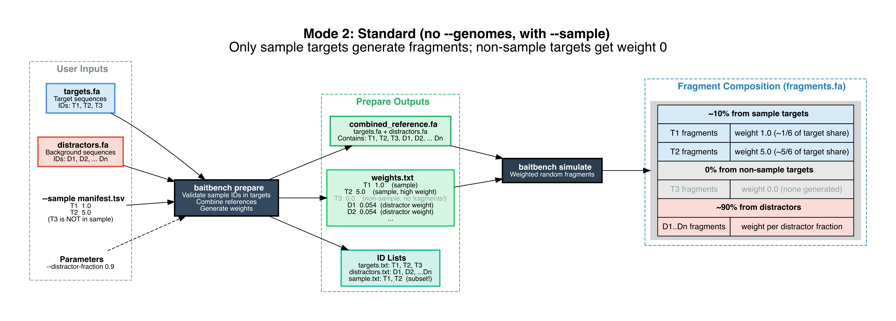
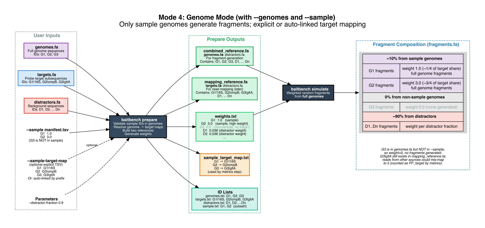

# Simulation Modes

BaitBench has two top-level modes (standard and genome) and two simulation algorithms (thermodynamic and simple). These are independent choices that can be combined in any combination.

---

## Standard Mode

Standard mode is the default. All sequences in `--targets` are treated as the direct source of simulated fragments. Probes are aligned to these target sequences, and fragments are sampled from the target (and distractor) sequences according to probe affinity and sequence weight.

**Use standard mode when:**
- Your probes are designed against the same sequences you're evaluating (e.g., virus panel probes tested on the same virus genomes)
- Your targets are small enough to serve as the complete reference (viral genomes, amplicons, gene sequences)
- You want to test whether the panel captures short, well-defined sequences

### Standard mode data flow

```
probes.fa
targets.fa    →  combined_reference.fa  →  fragment simulation  →  reads  →  map back to combined_reference.fa
distractors.fa
```

All sequences (targets + distractors) are placed into one combined reference. Fragments are generated from this combined reference according to per-sequence weights, probe alignment scores, and the `--capture-fraction` parameter.

#### Without `--sample`

Every target is in the sample at weight 1.0:

[](../diagrams/prepare_mode1_standard_nosample.png)

#### With `--sample`

Only the manifest targets generate fragments; the rest get weight 0, so any read reaching them is a false positive:

[](../diagrams/prepare_mode2_standard_sample.png)

---

## Genome Mode

Genome mode (`--genomes`) adds support for organisms where the probe targets are only a subset of the full genome. The canonical use case is 16S rRNA-based bacterial detection: probes cover the 16S gene, but a bacterial sample contains the entire chromosome. Fragments should come from the full genome (to accurately model the proportion of probe-binding vs. non-binding DNA in the library), but reads should be mapped back to the 16S reference sequences (where the probes were designed).

**Use genome mode when:**
- Your probes target a specific gene within a larger genome (16S rRNA, *rpoB*, *gyrB*)
- You want to accurately model the enrichment fold-change (most genomic DNA won't be captured)
- You have bacteria or fungi in your panel

### Genome mode data flow

```
probes.fa
genomes.fa     →  combined_reference.fa  →  fragment simulation  →  reads  →  map back to mapping_reference.fa
targets.fa   ↘                                                               ↗
distractors.fa →  mapping_reference.fa  ──────────────────────────────────
```

Two reference files are created at the prepare step:
- **combined_reference.fa** (genomes + distractors): the fragment source; probe alignment and weight assignment happen here
- **mapping_reference.fa** (targets + distractors): the mapping reference; reads are aligned here after capture

A read from a genomic fragment only maps successfully if it spans a region also present in the targets FASTA. This correctly models the expected enrichment: only the portion of the genome covered by the 16S sequence will generate mappable reads.

#### Without `--sample`

All genomes are in the sample; `prepare` builds both references and resolves the genome → target links:

[](../diagrams/prepare_mode3_genomes_nosample.png)

#### With `--sample`

Only sample genomes generate fragments. Non-sample genomes get weight 0, but their target sequences remain in `mapping_reference.fa` — so reads from other sources can mis-map to them and be counted as `FP_target`:

[](../diagrams/prepare_mode4_genomes_sample.png)

### Sample-target-map

In genome mode, metrics require knowing which target IDs correspond to which genome IDs. BaitBench supports automatic linking (exact ID match or `genome_id|target_id` prefix convention) or an explicit `--sample-target-map` TSV:

```
Mtb_H37Rv    Mtb_H37Rv|16S_rRNA
Mtb_H37Rv    Mtb_H37Rv|rpoB
S_aureus     S_aureus|16S_rRNA
```

This many-to-one and one-to-many mapping allows one genome to have multiple target sequences and vice versa.

---

## Weight Generation

Weights determine how many fragments come from each sequence in the simulation. The weight model is designed to match the experimental design: sample sequences are present at known concentrations, non-sample sequences are absent, and distractors represent background DNA.

### Standard mode weights

| Sequence type | Weight |
|---------------|--------|
| Sample targets | From manifest (default 1.0 per sequence) |
| Non-sample targets | 0.0 — not present in specimen |
| Distractors | Computed from distractor fraction (see below) |

**Distractor weight formula:**

```
distractor_weight = (distractor_fraction × total_sample_weight)
                    / (n_distractors × (1 - distractor_fraction))
```

This formula ensures that if you sum all weights, the total distractor weight relative to total sample weight equals `distractor_fraction : (1 - distractor_fraction)`. For example, with `--distractor-fraction 0.9`, 90% of fragments come from distractor sequences and 10% from sample targets.

Multiple distractor FASTA files are concatenated into one combined reference. All distractor sequences share the same per-sequence weight, regardless of sequence length.

### Genome mode weights

Same formula, but weights are assigned to genome IDs (not target IDs), and only sample genomes receive non-zero weights. Untargeted genomes — those in the genomes FASTA but with no match in the sample manifest and no target mapping — receive weight 0.

---

## Thermodynamic Mode vs Simple Mode

These are the two simulation algorithms, controlled by `--simulate-mode`.

### Thermodynamic mode (default)

Each probe-reference alignment is scored using the SantaLucia (1998) nearest-neighbor thermodynamic model. The score determines how likely a probe is to hybridize to a given sequence position at the specified hybridization temperature. Positions with high-affinity probe alignments generate proportionally more captured fragments; positions with low-affinity or no alignments contribute fewer fragments.

This models the physical reality of probe capture: a probe with 3 mismatches captures its target less efficiently than a perfect-match probe, especially at high hybridization temperatures.

**Use thermodynamic mode** (the default) when you want realistic capture efficiency predictions that account for sequence divergence and hybridization conditions.

### Simple mode (`--simulate-mode simple`)

All probe alignments above the minimum match threshold are treated as equally likely to capture. There is no thermodynamic weighting — any position covered by a probe alignment generates fragments at the same rate as any other covered position.

**Use simple mode** when:
- You want to test whether coverage (which positions are covered by probes at all) rather than affinity is the bottleneck
- You are debugging probe placement and want to eliminate thermodynamic variability
- You want faster runs (thermodynamic scoring is more computationally intensive)

The difference is most pronounced for probes with multiple mismatches: in thermodynamic mode they capture poorly; in simple mode they capture at full rate.

---

## Choosing Between Modes

| Scenario | Mode |
|----------|------|
| Virus panel (full genomes in targets.fa) | Standard |
| Bacteria (16S probes, full chromosome genomes) | Genome |
| Mixed panel with some bacteria, some viruses | Genome (genomes.fa = bacteria; targets.fa = 16S + virus genomes) |
| Realistic capture efficiency prediction | Thermodynamic (default) |
| Coverage gap analysis, probe placement testing | Simple |
| Quick iteration / parameter exploration | Simple (faster) |
