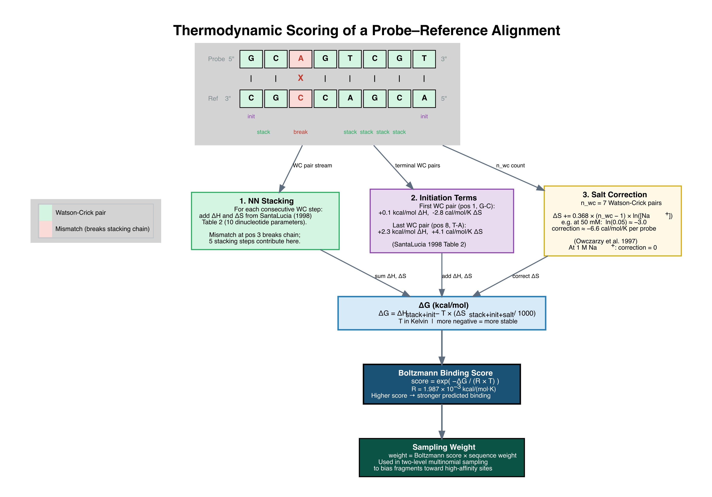
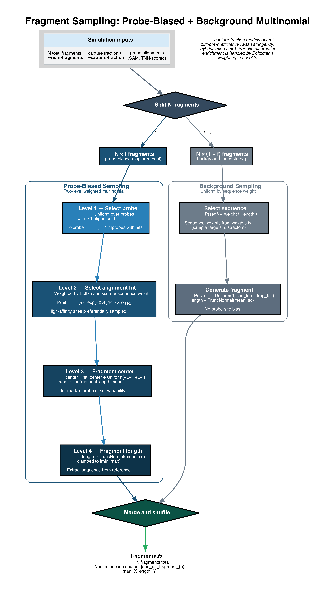

# Thermodynamic Scoring

BaitBench's thermodynamic simulation mode uses the SantaLucia (1998) nearest-neighbor (NN) model to score probe-target hybridization and weight the probability of fragment capture. This page explains the model and how it translates to capture efficiency predictions.

---

## Why Thermodynamics?

A probe captures its target if the probe-target duplex is stable enough under the hybridization conditions. Stability is determined by:

1. **Sequence composition**: GC base pairs form three hydrogen bonds (stronger) vs AT/AU two bonds (weaker)
2. **Context effects**: the stability of each base pair depends on its neighbours (nearest-neighbor effects)
3. **Temperature**: higher temperature destabilises duplexes; mismatches are more disruptive at high temperature
4. **Salt concentration**: Na⁺ ions screen the negative phosphate backbone charges, stabilising duplexes

A simple GC-content model misses all the context effects. The SantaLucia (1998) model captures them by summing stacking energies for each adjacent base-pair step — the dominant contribution to duplex stability.

---

## The SantaLucia Nearest-Neighbor Model

The nearest-neighbor model expresses ΔG of duplex formation as:

```
ΔG°(T) = ΔH° - T × ΔS°
```

Where ΔH° and ΔS° are the enthalpy and entropy of hybridization, each computed by summing over all adjacent dinucleotide steps in the sequence:

```
ΔH° = Σ ΔH°(stacking) + ΔH°(initiation)
ΔS° = Σ ΔS°(stacking) + ΔS°(initiation)
```

SantaLucia (1998) provides a unified table of 10 unique nearest-neighbor parameters (the 16 possible dinucleotide steps reduce to 10 by symmetry). BaitBench uses these published values directly.

---

## Computing ΔG: Three Contributions

A worked example, from an aligned probe-reference pair through to the sampling weight it produces:

[](../diagrams/paper_thermodynamic_scoring.png)

*One mismatch at position 3 breaks the stacking chain, so only 5 of the 7 possible stacking steps contribute. Click to enlarge.*

### 1. Stacking terms

For each consecutive base-pair dinucleotide in the probe-target alignment (5'→3'), BaitBench looks up the stacking ΔH° and ΔS° from the SantaLucia (1998) table. Mismatched positions contribute zero stacking energy (they break the consecutive run).

This means a probe with 3 mismatches in a run of otherwise matched positions loses the stacking contributions of all bases adjacent to those mismatches, not just the mismatches themselves. Clustered mismatches are disproportionately destabilising.

### 2. Initiation terms

Two initiation penalties are added, one for the **first** Watson-Crick pair of the aligned duplex and one for the **last**. SantaLucia (1998) gives separate AT and GC initiation parameters, and BaitBench applies whichever matches each terminal pair.

Initiation is only charged when at least one stacking step exists. An isolated Watson-Crick pair flanked by mismatches cannot form a stable duplex, so paying its initiation cost would produce ΔG > 0 — implying the probe is actively repelled, which is unphysical.

### 3. Salt correction (Owczarzy et al. 1997)

The SantaLucia parameters are derived at 1 M Na⁺. For realistic hybridization buffers, BaitBench corrects the **entropy** term for the actual Na⁺ concentration:

```
ΔS([Na⁺]) = ΔS(1 M) + 0.368 × (n_wc - 1) × ln([Na⁺])
```

Where `n_wc` is the number of Watson-Crick paired positions and `[Na⁺]` is molar. At 1 M, `ln(1) = 0` and no correction applies. At lower salt the correction is negative, making ΔG less favourable — matching the physical fact that duplexes are less stable when there are fewer cations to screen the phosphate backbone. As with initiation, the correction is skipped when there is no stacking.

The three contributions are then combined at the hybridization temperature:

```
ΔG = ΔH°(stacking + initiation) - T × ΔS°(stacking + initiation + salt) / 1000
```

With T in Kelvin, ΔH° in kcal/mol, ΔS° in cal/(mol·K), and ΔG in kcal/mol. More negative = more stable.

---

## Boltzmann Weighting

After computing ΔG for each probe alignment at each position, BaitBench converts it to a capture score:

```
score = exp(-ΔG / (R × T))
```

Where:
- R = 1.987 × 10⁻³ kcal/(mol·K) (gas constant)
- T = hybridization temperature in Kelvin
- ΔG is in kcal/mol

A favourable (negative) ΔG gives a score > 1. The score is **clamped to a minimum of 1.0**: probes can enrich fragments relative to background but never deplete them, so a duplex too weak to be stable (ΔG > 0) simply falls back to the neutral baseline rather than suppressing the site. Positions with no probe alignment are not in the captured pool at all.

These scores are used as sampling weights: positions with higher Boltzmann scores generate more captured fragments.

---

## From Scores to Fragment Sampling

[](../diagrams/paper_fragment_sampling.png)

*`--capture-fraction` splits the fragment budget between the probe-biased and background pools; the Boltzmann score then decides which probe sites within the captured pool are favoured. Click to enlarge.*

The simulation divides fragments into two categories:

**Captured fragments** (governed by `--capture-fraction`): drawn from positions with probe alignments, weighted by Boltzmann score. A position covered by two overlapping probes accumulates the scores of both alignments — higher effective capture probability.

**Background fragments** (governed by `1 - capture-fraction`): drawn uniformly from all positions in a sequence, regardless of probe coverage. These represent non-specific co-capture: fragments that end up in the capture library without being bound by a probe (e.g., because they were in solution adjacent to a captured molecule, or due to non-specific binding).

At `--capture-fraction 0.5` (the default), 50% of a sequence's fragments come from probe-covered positions (thermodynamically weighted) and 50% come from uniform background sampling. Background reads spread thinly across the entire sequence, producing low depth per position. Probe-captured reads concentrate at binding sites, producing high local depth — this is what creates the characteristic "spike" pattern in captured vs non-captured sequences.

---

## Simple Mode vs Thermodynamic Mode

In `--simulate-mode simple`, the Boltzmann weighting step is skipped. All alignments above the minimum match threshold are treated as equally likely to capture. This removes temperature and sequence composition effects.

| Feature | Thermodynamic | Simple |
|---------|---------------|--------|
| Mismatch penalty | Yes — via ΔG | No |
| Temperature effect | Yes — `--hybridization-temperature` affects capture | No |
| GC content effect | Yes — high-GC probes capture more efficiently | No |
| Probe-position weighting | Boltzmann-weighted | Uniform over covered positions |
| Use case | Realistic efficiency prediction | Coverage testing, speed |

Thermodynamic mode is more accurate; simple mode is faster and useful for understanding which positions probes cover at all, independent of efficiency.
