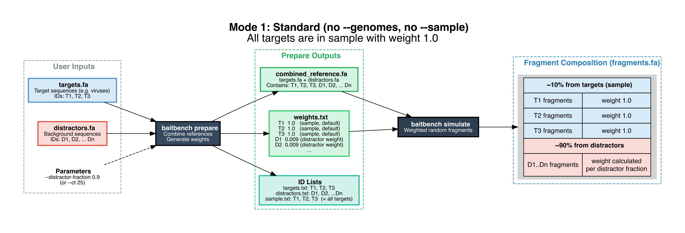
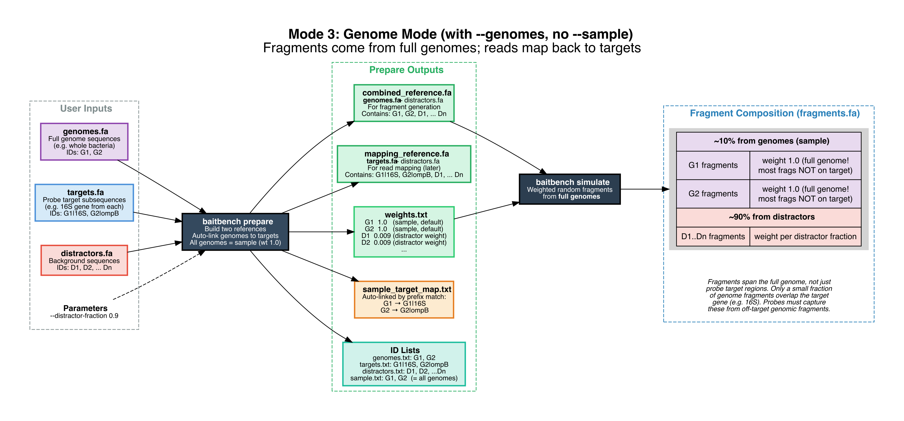

cd gui
make release
That single command:

Builds baitbench CLI (cargo build --release)
Copies it as the Tauri sidecar
Runs npm run tauri:build (produces .app + .dmg)
Runs package-release.mjs which:
Ad-hoc signs the .app with codesign --sign -
Copies both the .app/.dmg and the standalone baitbench CLI into gui/dist-release/
What users get:

File	Purpose
BaitBench.app	GUI — drag to Applications, double-click to launch
BaitBench_x.x.x_aarch64.dmg	Installer for the GUI
baitbench	Standalone CLI — copy to /usr/local/bin
Gatekeeper (unsigned distribution): Since the app isn't notarized, users need to right-click → Open on first launch, or run xattr -d com.apple.quarantine BaitBench.app. The script prints this reminder. If you get an Apple Developer account later, xcrun notarytool submit is the path to fully transparent installs.


Yes. Tauri uses a set of pre-sized PNG/ICNS files generated from a single source image.

**Source image requirements:**

* Square (1:1 aspect ratio)
* At least **1024×1024 pixels**
* **RGBA PNG** (transparency supported but not required)

**How to set it:**

Tauri has a built-in command that takes your source image and generates all the required icon sizes automatically:

```bash
cd gui
npm run tauri icon /path/to/your-icon.png
```

This overwrites `gui/src-tauri/icons/` with the full set of correctly-sized files (`32x32.png`, `128x128.png`, `128x128@2x.png`, `icon.icns` for macOS, `icon.ico` for Windows, etc.) and updates `tauri.conf.json` to reference them.

Then rebuild:

```bash
make release
```


---

# Removed from paper


#### Step 1 — Prepare

The prepare step function is to create a single fasta file with all sequences, along with a weights file that specifies what is in the simulated sample, and in what proportion. The total amount of distractor sequence can specified by either a simple percentage, or a hypothetical CT (cycle threshold) value from qPCR quantifies pathogen abundance — higher CT means lower concentration, with each unit representing a two-fold dilution. BaitBench converts CT to a target DNA fraction using $\text{target\_fraction} = \text{ct\_baseline\_fraction} \times 2^{\text{ct\_baseline} - \text{ct}}$ defaulting to a calibration point of CT 20 = 1% target DNA, so CT 25 yields ~0.03% and CT 30 ~0.001%; the remainder becomes the distractor fraction, directly linking real clinical sample measurements to simulation parameters. in genome mode two references are generated, a combined genome+distractor reference for fragment generation, and a target+distractor reference for read mapping; sample-target-map links genome IDs to target IDs.


FIG_PREPARE_1




FIG_PREPARE_3




#### Step 2 — Simulate (thermodynamic fragment generation)

The simulate step is modeled directly on RAmpSim [@zhangRAmpSimThermodynamicSimulator2025]. Probes are aligned to the combined reference with minimap2 [@liMinimap2PairwiseAlignment2018], CIGAR and MD tags are parsed via an internal tool to reconstruct per-position (probe_base, ref_base) pairs for each alignment.  Gibbs free energy (ΔG) is calculated for each probe-reference alignment using the SantaLucia (1998) nearest-neighbor model via a `ThermoModel` struct (temperature and salt concentration).  NN stacking accumulates stacking energy over consecutive Watson-Crick pairs, mismatches break the stacking chain (SkipStacking strategy) Initiation terms add AT (+2.3 kcal/mol ΔH, +4.1 cal/mol/K ΔS) or GC (+0.1, −2.8) initiation penalty for the first and last WC terminal of each alignment (SantaLucia 1998 Table 2) Salt correction adjusts ΔS for actual Na+ concentration via Owczarzy et al. [@owczarzyPredictingSequencedependentMelting1997]: `ΔS += 0.368 × (n_wc−1) × ln([Na+])`; user-specified via `--salt-concentration` (mM, default 50 mM). At 1 M the correction is exactly zero. Convert to Boltzmann binding score: `score = exp(−ΔG / RT)` at user-specified hybridization temperature. Now we can use a Two-level multinomial fragment sampling for captured reads:
  1. Sample a probe uniformly from probes with ≥1 alignment hit
  2. Sample an alignment hit for that probe, weighted by Boltzmann_score × sequence_weight
  3. Fragment center: alignment center ± uniform jitter (±fragment_length/4)
  4. Fragment length: sampled from truncated normal distribution (user-specified mean, SD, min, max)
- Background fragments (fraction `1 − capture_fraction`): sampled uniformly weighted by sequence_weight × sequence_length. To model incomplete capture efficiency in real experiments we use the single parameter.
  Target enrichment is and emergent property of the thermodynamic sampling method. 


FIG_THERMO


#### Step 3 — Sequence
We need to fix this. Right now we simply trim to sequence length. It wont be hard to add some read simulators. Probably want to add short read, long read, paired end.

#### Step 4 — Filter (optional)
Map reads against host genome(s); discard mapping reads; models host depletion step in real workflows

#### Step 5 — Map
Align reads to combined reference with minimap2; configurable preset and secondary alignment settings

#### Step 6 — List
Parse SAM; count reads per reference sequence

#### Step 7 — Metrics (3-way classification)
- Classification at genome/group level (was each target detected?):
  - **TP**: sample target detected
  - **FN**: sample target not detected
  - **FP_target**: non-sample target within panel detected (within-panel cross-reactivity)
  - **TN_target**: non-sample target within panel not detected
  - **FP_distractor**: distractor detected (off-target capture)
  - **TN_distractor**: distractor not detected
  - **Untargeted**: genome-mode genomes with no target mapping (tracked separately)

From this we are able to calculate summary metrics, coverage statistics: per-reference depth, pct_covered_5x, pct_covered_20x we implemented read-level tracking so we can report correctly mapped, incorrectly mapped, source vs. mapping destination.

#### Step 8 — Report
BaitBench produces a self-contained HTML report generated via RMarkdown (or an .Rmd file the user can alter for custom graphics). The report contains a sankey diagram of fragment flow (generation → capture → sequencing → filtering → mapping), performance metrics bar charts, detection detail lollipop chart, a confusion matrix, coverage depth plots, and interactive tables of useful metrics. Every report BaitBench gernerates includes a parameters section with a reconstructed CLI command for reproducibility.


