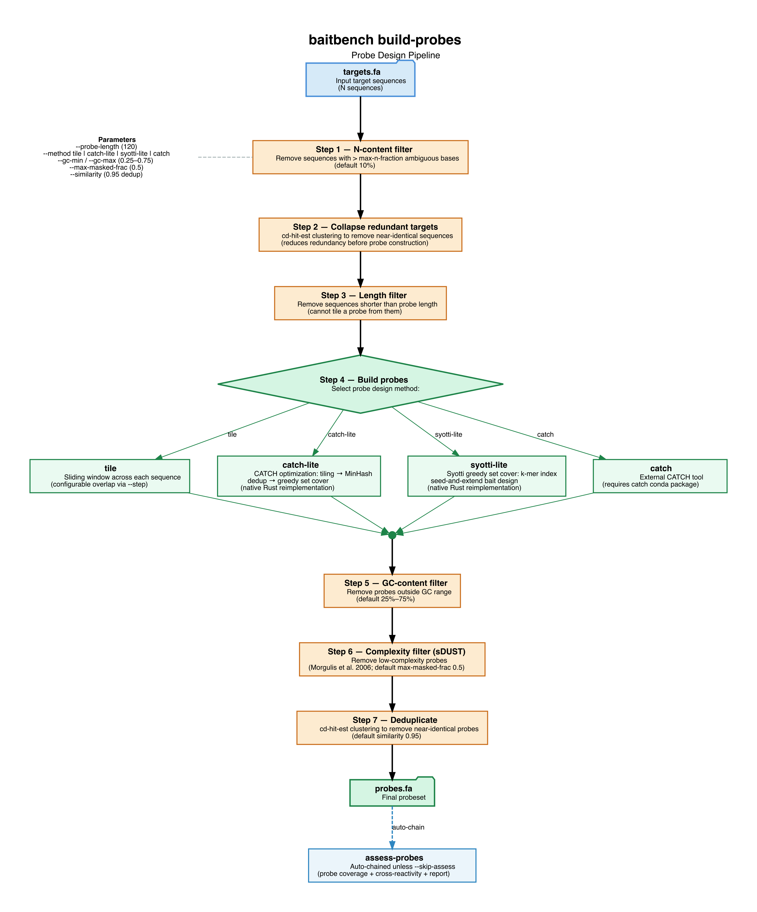
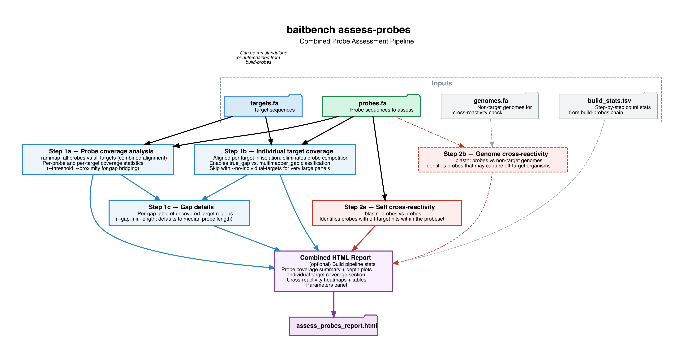
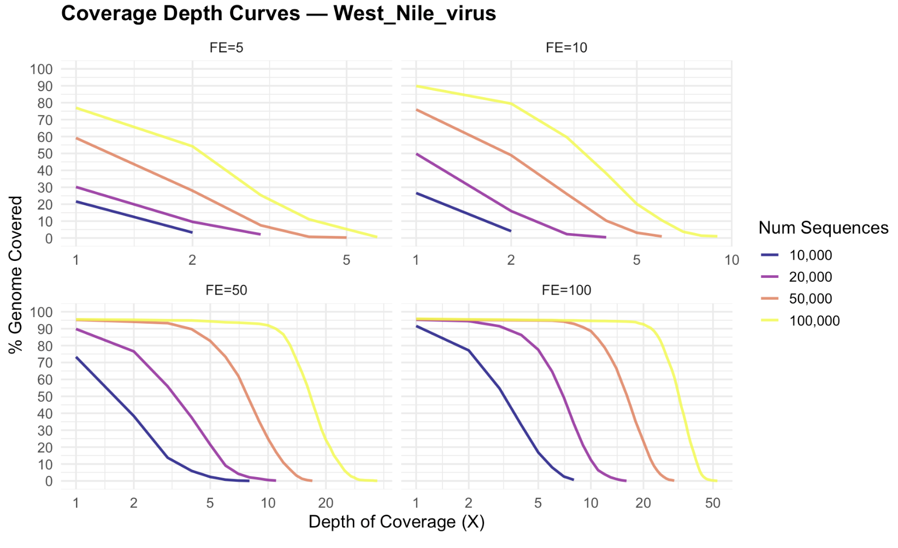

# BaitBench: an easy tool for building, assessing, and predicting outcomes for target sequence capture probes

Aniello M Infante^1^, Shaun T Cross^1*^ 

1. Department of Environmental, Agricultural, and Occupational Health, University of Nebraska Medical Center, Omaha, Nebraska, USA

## Abstract

## Introduction

Hybridization-based target capture, sometimes called bait capture or hybrid-capture enrichment, has become an essential technique for selectively sequencing genomic targets of interest from complex nucleic acid mixtures. In the protocol, a set of biotinylated oligonucleotide probes hybridize to complementary nucleic acids in a library, streptavidin-coated beads then pull down probe-bound fragments enriching for select targets and the unbound nucleic acid washed away, then the enriched library is sequenced. The result is an orders-of-magnitude increase in on-target read depth, enabling applications that are otherwise prohibitively expensive or impossible with whole sample sequencing alone. Hybrid-capture target capture is essential for detecting low-abundance targets in complex backgrounds such as clinical metagenomics, pathogen surveillance, antimicrobial resistance gene detection, viral genomics, ancient DNA,  and whole-exome sequencing (Bravo et al. 2025). For many of these settings the target represents as little as 0.001–1% of the total nucleic acid in the sample, making the design and performance of the probe set the decisive factor between a successful assay and a failed one.

Tools such as CATCH [@metskyCapturingSequenceDiversity2019], Syotti [@alankoSyottiScalableBait2022], and ProbeTools [@kuchinskiProbeToolsDesigningHybridization2022] can efficiently construct minimal probe sets with guaranteed coverage across diverse, rapidly evolving viral targets. However, a systematic gap remains between designing a probe panel and predicting how it will perform. Prior to probe synthesis and wet-lab validation, there is no broadly adopted approach for predicting sensitivity as a function of target abundance, specificity against a background of host and other distractor sequences, within-panel cross-reactivity of probes, or coverage uniformity across target sequences. 

Wet-lab iteration for validation of probes is expensive, slow, and labor intensive. On the other hand, _in silico_ evaluation is quick and cheap, though often underutilized and complicated by multiple tools with diverse dependencies and conventions. When simulations are used, they commonly assume uniform per-base capture probability, an approximation that ignores the sequence dependent binding affinities that govern real hybridization. Recent work on RAmpSim @zhangRAmpSimThermodynamicSimulator2025 demonstrated that thermodynamic simulation using the SantaLucia nearest-neighbor (TNN) model   [@santaluciaUnifiedViewPolymer1998] can produce substantially more realistic coverage distributions than uniform models. However, RAmpSim addresses only the simulation step; it does not include probe design, structured probe quality control, or quantitative performance metrics, leaving users to assemble these capabilities from separate tools with incompatible formats and dependencies.

Here we present BaitBench, an end-to-end computational suite for designing, assessing, and benchmarking probe panels for target capture sequencing. BaitBench integrates native Rust reimplementations of the CATCH and Syotti probe design algorithms with a quality-controlled build pipeline, a comprehensive probe assessment module, and a full thermodynamic simulation pipeline. The simulation pipeline supports both whole genome sequence analysis for smaller targets such as viruses and specific genetic loci targets within a full genome. To directly connect simulations to real-world practice, BaitBench accepts qPCR cycle-threshold (CT) scores as input, automatically converting them to estimated target nucleaic acid fractions to predict the efficiency and limitation of designed probes _insilico_. Performance is evaluated with a three-way classification scheme that separately quantifies within-panel cross-reactivity and true off-target capture, a clinically meaningful distinction that a binary detected/not-detected call obscures. BaitBench also offers the ability to simulate how different temperatures, capture efficiencies, and sequencing depths will effect target coverage, giving some direction for experiment design. Written in Rust for performance and distributed with an optional desktop GUI, BaitBench is designed to lower the barrier to rigorous probe panel evaluation for both command-line and non-specialist users.

## Features and Functionality

BaitBench is a full featured capture sequence tool and can be broadly split into three functionalities: building probes, assessing probes, and simulating capture.

### Building Probes

 By default, the pipeline will do quality control (QC) of input sequences by collapsing redundant sequences with cd-hit [@liCdhitFastProgram2006], removing sequences of more than 5% Ns, and removing short sequences (default to probe length). For building the probes, options are to use it as a tool wrapper for CATCH (Metsky et al. 2019), a simplistic built-in tiling algorithm, or simplified, built-in versions of CATCH or Syotti (Alanko et al. 2022) written in Rust. After the probes are generated, subsequent QC occurs. Probes with low complexity are filtered out with an internal implementation of sDust [@morgulisFastSymmetricDUST2006] and a threshold of 20-80% GC content is maintained. At the completion of the building probes, a summary of sequences input, filtered sequences, number of probes built, and number of filtered probes is provided for each step.

FIG_BUILD:
 

### Assessing Probes

Assess-probes is automatically run after building probes, but it can also be run on probes built with other tools or rerun on probe sets that were designed using different parameters during the building process. Host or ‘background’ genomes can be added to test probe specificity. BaitBench first aligns all probes to all input targets using minimap2 [@liMinimap2PairwiseAlignment2018]. From this mapping, a condensed summary of target coverage and frequency of multimapping probes is provided in a graphical format. A full searchable table of all targets is provided with detailed coverage statistics. Together, these show coverage and gaps for targets in multiple manners, to give insight into probe performance. Probes are then mapped to themselves to assess cross reactivity and competition between probes using the xreact module. Graphic summaries are given and any problematic probes are presented in table format. If host or ‘background’ genomes are provided, probes are mapped against them, and any off-target binding across the genomes areas are identified. Discerning coverage amongst multiple similar, but not identical targets, can become problematic as minimap2 will not always find all alignments for a probe, even with high secondary alignment settings. To address this issue, BaitBench has various refinement options to rerun the mapping with only the low coverage targets and this can support multiple rounds of refinement. In extreme circumstances where every target certainty is essential, options exist to map probes to each target in isolation. Although this may reduce efficiency in speed, this use case may be dictated by both biological relevance and the number of targets that are expected to co-occur in a sample.

FIG_ASSESS

### Simulating Capture

Assessing probes assumes a (near) perfect world. To simulate a more realistic capture experiment incorporating all steps in the process, BaitBench integrates an eight step process to simulate hybrid capture enrichment sequencing. Each step can be run separately and all intermediate files are documented and retained, the pipeline can be re-entered at any step.

**Prepare** creates a single fasta file containing all sequences, along with a weights file that specifies what is in the simulated sample, and in what proportion. **Simulate** aligns all probes to possible binding locations, Gibbs free energy is calculated, and fragments are generated randomly weighted by thermodynamic properties and sequence input weight. **Sequence** models the actual sequencing step either perfectly via fragment trimming, or using the wrapped sequence simulators ART-modern [@yuArt_modernAcceleratedART2026] or Badread [@wickBadreadSimulationErrorprone2019]. **Filter** is an optional step removing host sequence. **Map** aligns reads to the target sequence, and **List** parses the sam output and counts reads per reference sequence. **Metrics** computes a three way classification of true/false negative/positive target/distractor hits. And finally **Report** produces a self-contained HTML report generated via RMarkdown. A much more detailed discussion of each of these steps is available in the BaitBench documentation.

Expanding on the simulate step, our thermodynamic model is based directly on RAmpSim. Minimap2 maps probes to the sample sequence promiscuously, giving all possible bindings. For each possible binding site, 

By computing the Gibbs free energy for each probe-reference alignment and converting it to a Boltzmann-weighted binding probability, fragment enrichment near high-affinity sites emerges naturally from the physics of hybridization rather than from an imposed enrichment parameter.

based on the SantaLucia (1998) nearest-neighbor model, including initiation terms, Boltzmann-weighted fragment sampling, and a sodium concentration correction following Owczarzy et al. [@owczarzyPredictingSequencedependentMelting1997]

$\Delta$G

- Align probes to combined reference with minimap2; parse CIGAR + MD tags to reconstruct per-position (probe_base, ref_base) pairs for each alignment
- **Thermodynamic scoring**: compute ΔG (Gibbs free energy) for each probe-reference alignment using the SantaLucia (1998) nearest-neighbor model via a `ThermoModel` struct (temperature + salt concentration)
  - *NN stacking*: accumulate stacking energy over consecutive Watson-Crick pairs; mismatches break the stacking chain (SkipStacking strategy)
  - *Initiation terms*: add AT (+2.3 kcal/mol ΔH, +4.1 cal/mol/K ΔS) or GC (+0.1, −2.8) initiation penalty for the first and last WC terminal of each alignment (SantaLucia 1998 Table 2)
  - *Salt correction*: adjust ΔS for actual Na+ concentration via Owczarzy et al. (1997): `ΔS += 0.368 × (n_wc−1) × ln([Na+])`; user-specified via `--salt-concentration` (mM, default 50 mM); at 1 M the correction is exactly zero
  - Convert to Boltzmann binding score: `score = exp(−ΔG / RT)` at user-specified hybridization temperature
- **Two-level multinomial fragment sampling** for captured reads:
  1. Sample a probe uniformly from probes with ≥1 alignment hit
  2. Sample an alignment hit for that probe, weighted by `Boltzmann_score × sequence_weight`
  3. Fragment center: alignment center ± uniform jitter (±fragment_length/4)
  4. Fragment length: sampled from truncated normal distribution (user-specified mean, SD, min, max)
- Background fragments (fraction `1 − capture_fraction`): sampled uniformly weighted by `sequence_weight × sequence_length`
- Capture fraction (`--capture-fraction`): controls ratio of probe-biased to background fragments; models incomplete capture efficiency in real experiments
- Target enrichment is emergent — no imposed fold-enrichment parameter

The simulate step is modeled directly on RAmpSim [@zhangRAmpSimThermodynamicSimulator2025]. Probes are aligned to the combined reference with minimap2 [@liMinimap2PairwiseAlignment2018], CIGAR and MD tags are parsed via an internal tool to reconstruct per-position (probe_base, ref_base) pairs for each alignment.  Gibbs free energy (ΔG) is calculated for each probe-reference alignment using the SantaLucia (1998) nearest-neighbor model via a `ThermoModel` struct (temperature and salt concentration).  NN stacking accumulates stacking energy over consecutive Watson-Crick pairs, mismatches break the stacking chain (SkipStacking strategy) Initiation terms add AT (+2.3 kcal/mol ΔH, +4.1 cal/mol/K ΔS) or GC (+0.1, −2.8) initiation penalty for the first and last WC terminal of each alignment (SantaLucia 1998 Table 2) Salt correction adjusts ΔS for actual Na+ concentration via Owczarzy et al. [@owczarzyPredictingSequencedependentMelting1997]: `ΔS += 0.368 × (n_wc−1) × ln([Na+])`; user-specified via `--salt-concentration` (mM, default 50 mM). At 1 M the correction is exactly zero. Convert to Boltzmann binding score: `score = exp(−ΔG / RT)` at user-specified hybridization temperature. Now we can use a Two-level multinomial fragment sampling for captured reads:
  1. Sample a probe uniformly from probes with ≥1 alignment hit
  2. Sample an alignment hit for that probe, weighted by Boltzmann_score × sequence_weight
  3. Fragment center: alignment center ± uniform jitter (±fragment_length/4)
  4. Fragment length: sampled from truncated normal distribution (user-specified mean, SD, min, max)
- Background fragments (fraction `1 − capture_fraction`): sampled uniformly weighted by sequence_weight × sequence_length. To model incomplete capture efficiency in real experiments we use the single parameter.
  Target enrichment is and emergent property of the thermodynamic sampling method. 

### Coverage Curve

This module allows user to do a parameter sweep over some key parameters: capture fraction, temperature, number of sequences generated, and initial fraction of desired sample present. The resulting coverage curve gives users insights into the effort needed to reach coverage sufficient for their downstream analyses. 

FIG_COVERAGE_CURVE   - Need a better one, this one still has fold enrichment which is no longer a parameter.

### Other Modules
**Species identification** (`baitbench identify`)   When working with similar species, and targeting the same genes in each, there is the concern that even with perfect capture you may not be able to tell species apart. This tool will look at all of the targets of every species, and consider the homology between them. Species are then called PRESENT if unique marker targets detected, ABSENT when all hits explained by cross-reactivity, AMBIGUOUS when indeterminate.
 **Cross-reactivity** (`baitbench xreact`): Standalone probe cross-reactivity check against genomes and/or other probes based on homology. Also useful to check if your targets are close.
## 

## Validation Using Public Data

To evaluate BaitBench simulation, we used sequence and probe data from TELSeq comprising a mock microbial community (ZymoBIOMICS Microbial Community DNA Standard II \[Log Distribution]) [@slizovskiyTargetenrichedLongreadSequencing2022]. We used BaitBench to construct an input sample with the TELSeq community abundances, then BaitBench used the provided probes to simulate capture and sequencing. The proportions of reads for each species matched the real data very well, with a Spearman correlation of 0.884. The farthest outlier, _M smithii_, has only 6 reads in the public set making it susceptible to big fold change differences with just a few changes in reads. Species in greater abundance are simulated very closely to reality.  

### Differences with rust implementation
Speed up,
Not everything implemented
    Syotti - No FM-index, so not great on large data (> 1GB)
    Catch - Different, but how?

## Discussion

BaitBench provides a single install to a center for sequence capture probe design and simulation. 

The difficult with _M smithii_ highlights one issue with how BaitBench implements the capture. Probes are first mapped to all possible binding sites and delta G computed for each. Among all probes that mapped, one is selected uniformly at random, and then its binding site is selected randomly weighted by thermodynamics and sequence abundance, and finally a fragment overlapping that probe coverage is generated. This can lead to over-selecting rare species. The obvious solution is to select probes based on the sequence abundance of all their targets. However, this leads to over-selecting common species. To compensate, probe concentration and usage would have to be modeled which entails computational complexities and parameters the users may not have access to. BaitBench also does not explicitly model hybridization time or wash stringency dynamics. Future work will consider modeling these and more complications, though we suspect that general Biological noise will swamp these considerations away. Rather, for all these subtleties we use the capture fraction parameter as a pragmatic proxy. BaitBench still gets very close to real data, and is useful as a simulation and prediction tool.

## Distribution

All code is available at [github.com/niel-infante/BaitBench.](https://github.com/niel-infante/BaitBench) Experts can clone the repo, install dependencies with Conda, and compile the Rust. Others can download the installers for Mac and Windows available at [github.com/niel-infante/BaitBench/releases](https://github.com/niel-infante/BaitBench/releases).

### Future Directions
GUI~~
editing probests 
    Remove redundant or useless probes
    Add probes to targeted, low coverage areas
RNA binding numbers

In documentation, include some helpful cli commands, such as how to create a sample group file from a target.fa

## References

