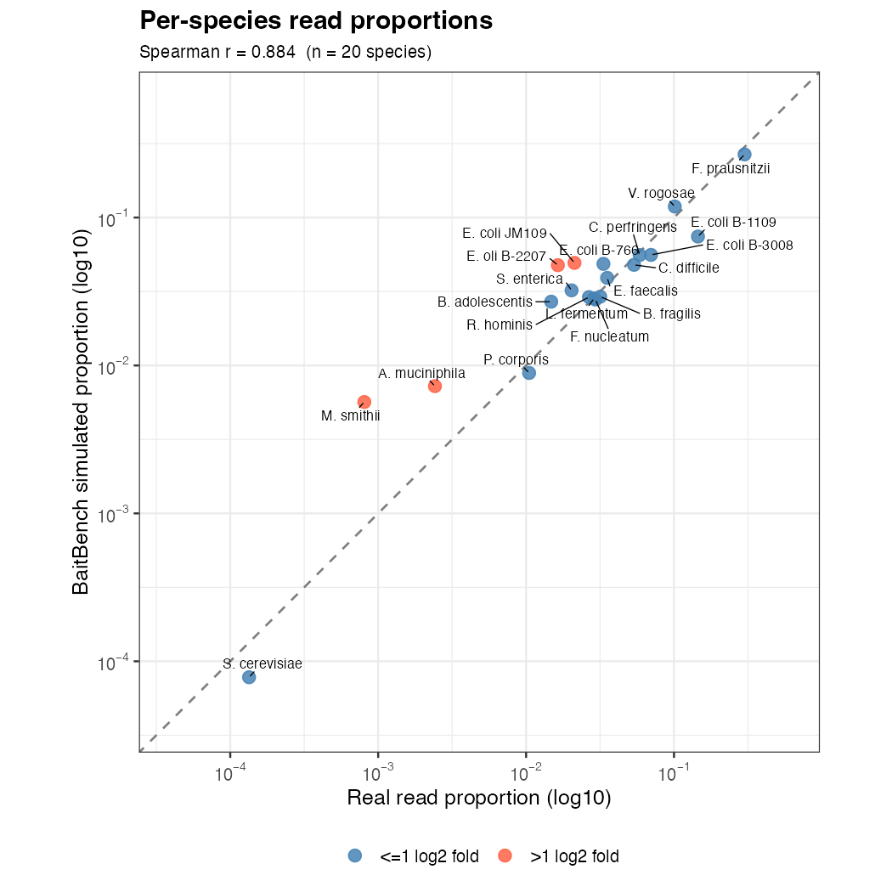

# BaitBench: an easy tool for building, assessing, and predicting outcomes for target sequence capture probes

Aniello M Infante^1^, Shaun T Cross^1*^ 

1. Department of Environmental, Agricultural, and Occupational Health, University of Nebraska Medical Center, Omaha, Nebraska, USA

## Abstract

## Introduction

Hybridization-based target capture selectively enriches genomic targets from complex nucleic acid mixtures by hybridizing biotinylated oligonucleotide probes to complementary library fragments, pulling down probe-bound material with streptavidin beads, and sequencing the enriched fraction. The result is an orders-of-magnitude increase in on-target read depth, making the approach essential wherever targets represent a small fraction of total nucleic acid such as in clinical metagenomics, pathogen surveillance, antimicrobial resistance gene detection, viral genomics, ancient DNA, and whole-exome sequencing (Bravo et al. 2025). In these settings, where targets may constitute as little as 0.001–1% of total nucleic acid, probe panel design and performance are the decisive factors between a successful assay and a failed one.

Tools such as CATCH [@metskyCapturingSequenceDiversity2019], Syotti [@alankoSyottiScalableBait2022], and ProbeTools [@kuchinskiProbeToolsDesigningHybridization2022] can efficiently construct probe sets with guaranteed coverage across diverse, rapidly evolving targets. However a systematic gap remains between designing a panel and predicting how it will perform. No broadly adopted approach exists for estimating sensitivity as a function of target abundance, specificity against host or background sequences, within-panel cross-reactivity, or coverage uniformity before probes are synthesized and wet-lab validation begins. Wet-lab iteration is expensive, slow, and labor-intensive; _in silico_ evaluation is cheap and fast but underutilized, in part because it requires assembling multiple tools with incompatible formats and dependencies, and requires specialized knowledge.. When simulations are used, they typically assume uniform per-base capture probability, ignoring the sequence-dependent binding affinities that govern real hybridization. Recent work on RAmpSim [@zhangRAmpSimThermodynamicSimulator2025] demonstrated that thermodynamic simulation using the SantaLucia nearest-neighbor model [@santaluciaUnifiedViewPolymer1998] produces substantially more realistic coverage distributions, but RAmpSim addresses only the simulation step and does not include probe design, quality control, or quantitative performance metrics.

Here we present BaitBench, an end-to-end suite for designing, assessing, and benchmarking probe panels. BaitBench integrates Rust reimplementations of CATCH and Syotti with a quality-controlled build pipeline, alignment-based probe assessment, and a full thermodynamic simulation of the capture-sequencing workflow extended beyond RAmpSim with AT/GC initiation penalties and sodium concentration correction. A three-way classification scheme separately quantifies within-panel cross-reactivity and true off-target capture — a distinction that binary detected/not-detected calls obscure. BaitBench accepts qPCR CT values as input to translate clinical measurements directly into predicted sequencing outcomes, and a parameter-sweep module models the effects of capture temperature, sequencing depth, and target abundance to guide experimental design. Written in Rust and distributed with an optional desktop GUI, BaitBench is designed to lower the barrier to rigorous probe panel evaluation for command-line and non-specialist users alike.

## Features and Functionality

BaitBench is a full featured capture sequence tool and can be broadly split into three functionalities: building probes, assessing probes, and simulating capture.

### Building Probes

 The pipeline starts with quality control (QC) of input sequences by collapsing redundant sequences with cd-hit [@liCdhitFastProgram2006], removing sequences of more than 5% Ns, and removing short sequences (default to probe length). Moving on, options are to use it as a tool wrapper for CATCH (Metsky et al. 2019), a simplistic built-in tiling algorithm, or simplified, built-in versions of CATCH or Syotti (Alanko et al. 2022) written in Rust. After the probes are generated, subsequent QC occurs. Probes with low complexity are filtered out with an internal implementation of sDust [@morgulisFastSymmetricDUST2006] and a threshold of 20-80% GC content is maintained. At the completion of the building probes, a summary of sequences input, filtered sequences, number of probes built, and number of filtered probes is provided for each step.

### Assessing Probes

Assess-probes is automatically run after building probes, but it can also be run on probes built with other tools or rerun on probe sets that were designed using different parameters during the building process. Host or ‘background’ genomes can be added to test probe specificity. BaitBench first aligns all probes to all input targets using minimap2 [@liMinimap2PairwiseAlignment2018]. From this mapping, a condensed summary of target coverage and frequency of multimapping probes is provided in a graphical format. A full searchable table of all targets is provided with detailed coverage statistics. Together, these show coverage and gaps for targets in multiple manners, to give insight into probe performance. Probes are then mapped to themselves to assess cross reactivity and competition between probes using the xreact module. Graphic summaries are given and any problematic probes are presented in table format. If host or ‘background’ genomes are provided, probes are mapped against them, and any off-target binding across the genomes areas are identified. Discerning coverage amongst multiple similar, but not identical targets, can become problematic as minimap2 will not always find all alignments for a probe, even with high secondary alignment settings. To address this issue, BaitBench has various refinement options to rerun the mapping with only the low coverage targets and this can support multiple rounds of refinement. In extreme circumstances where every target certainty is essential, options exist to map probes to each target in isolation. Although this may reduce efficiency in speed, this use case may be dictated by both biological relevance and the number of targets that are expected to co-occur in a sample.

### Simulating Capture

Assessing probes assumes a (near) perfect world. To simulate a more realistic capture experiment incorporating all steps in the process, BaitBench integrates an eight step process to simulate hybrid capture enrichment sequencing. Each step can be run separately and all intermediate files are documented and retained, the pipeline can be re-entered at any step.

**Prepare** creates a single fasta file containing all sequences, along with a weights file that specifies what is in the simulated sample, and in what proportion. **Simulate** aligns all probes to possible binding locations, Gibbs free energy is calculated, and fragments are generated randomly weighted by thermodynamic properties and sequence input weight. **Sequence** models the actual sequencing step either perfectly via fragment trimming, or using the wrapped sequence simulators ART-modern [@yuArt_modernAcceleratedART2026] or Badread [@wickBadreadSimulationErrorprone2019]. **Filter** is an optional step removing host sequence. **Map** aligns reads to the target sequence, and **List** parses the sam output and counts reads per reference sequence. **Metrics** computes a three way classification of true/false negative/positive target/distractor hits. And finally **Report** produces a self-contained HTML report generated via RMarkdown. A much more detailed discussion of each of these steps is available in the BaitBench documentation.

To expand on the simulate step, our thermodynamic model follows RAmpSim [@zhangRAmpSimThermodynamicSimulator2025]. Probes are aligned promiscuously to the combined reference with minimap2; CIGAR and MD tags are parsed to reconstruct per-position base pairs for each alignment. Gibbs free energy is then calculated for each probe–reference duplex using the SantaLucia nearest-neighbor model [@santaluciaUnifiedViewPolymer1998]:
$$\Delta G = \sum_{i} \Delta G_{\text{NN},i} + \Delta G_{\text{init}} + \Delta G_{\text{Na}^+}$$
where the sum runs over consecutive Watson–Crick stacking pairs, $\Delta G_{\text{init}}​$ applies AT/GC initiation penalties, and $\Delta G_{\text{Na}^+}$ ​is a sodium concentration correction following Owczarzy et al. \[@owczarzyPredictingSequencedependentMelting1997]. These last two terms extend beyond RAmpSim.

Each $\Delta$G is converted to a Boltzmann-weighted binding score  $w \propto e^{-\Delta G / RT}$. Fragment sampling then proceeds in two levels: first, a probe is drawn uniformly from all probes with at least one alignment; second, a specific alignment site is sampled weighted by $w$ and the abundance of the target sequence. A fragment is generated around that site with length drawn from a truncated normal distribution. A user-specified capture fraction sets the ratio of these probe-biased fragments to background fragments, which are sampled uniformly across the reference weighted by sequence length and abundance. Target enrichment emerges from the thermodynamic sampling itself rather than being imposed as an explicit parameter.

### Coverage Curve

This module allows user to do a parameter sweep over some key parameters: capture fraction, temperature, number of sequences generated, and initial fraction of desired sample present. The resulting coverage curve gives users insights into the effort needed to reach coverage sufficient for their downstream analyses. 

### Other Modules
**Species identification** (`baitbench identify`)   When working with similar species, and targeting the same genes in each, there is the concern that even with perfect capture you may not be able to tell species apart. This tool will look at all of the targets of every species, and consider the homology between them. Species are then called PRESENT if unique marker targets detected, ABSENT when all hits explained by cross-reactivity, AMBIGUOUS when indeterminate.
 **Cross-reactivity** (`baitbench xreact`): Standalone probe cross-reactivity check against genomes and/or other probes based on homology. Also useful to check if your targets are close.
## 

## Validation Using Public Data

To evaluate BaitBench simulation, we used sequence and probe data from TELSeq comprising a mock microbial community (ZymoBIOMICS Microbial Community DNA Standard II \[Log Distribution]) [@slizovskiyTargetenrichedLongreadSequencing2022]. We used BaitBench to construct an input sample with the TELSeq community abundances, then BaitBench used the provided probes to simulate capture and sequencing. The proportions of reads for each species matched the real data very well, with a Spearman correlation of 0.884. 

The _M smithii_ outlier points to a limitation in our model concerning probe selection. Probes are selected uniformly from all probes that map anywhere, and once a probe is selected then thermodynamics is considered. This procedure can over-select rare species such as _M. smithii_, with only 6 reads in the real data. The natural correction, weighting probe selection by target sequence abundance, leads to the opposite problem of over-selecting common species, and fully compensating for this would require modeling probe concentration and usage, introducing computational complexity and parameters users may not have access to. BaitBench also does not explicitly model hybridization time or wash stringency dynamics. Future work will consider modeling these and more complications, though we suspect that general biological noise will swamp these considerations away. Rather than attempting to resolve these interdependencies, we use the capture fraction parameter as a pragmatic proxy for these combined effects. Despite these simplifications, species in greater abundance are simulated very closely to reality and BaitBench produces output that closely resembles real capture data across most species and remains a useful tool for simulation and prediction.

### Differences with rust implementation

JUST REMOVE THIS ALL I THINK

Speed up,
Not everything implemented
    Syotti - No FM-index, so not great on large data (> 1GB)
    Catch - Different, but how?

## Discussion

BaitBench provides a single install to a center for sequence capture probe design and simulation. Tools like Catch and Syotti are not supported on Windows, and may be difficult to install. Our Rust implementation and installation process makes these tools available to naive users. For all users we provide and integrated environment to build, assess and experiment with capture probes. 

## Distribution

All code is available at [github.com/niel-infante/BaitBench.](https://github.com/niel-infante/BaitBench) Experts can clone the repo, install dependencies with Conda, and compile the Rust. Others can download the installers for Mac and Windows available at [github.com/niel-infante/BaitBench/releases](https://github.com/niel-infante/BaitBench/releases).

### Future Directions
GUI~~
editing probests 
    Remove redundant or useless probes
    Add probes to targeted, low coverage areas
RNA binding numbers

In documentation, include some helpful cli commands, such as how to create a sample group file from a target.fa

## References

